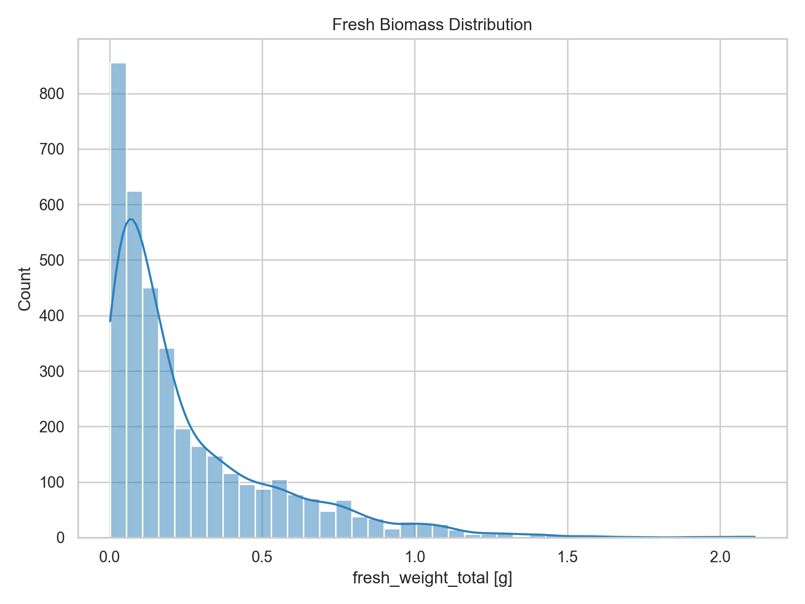
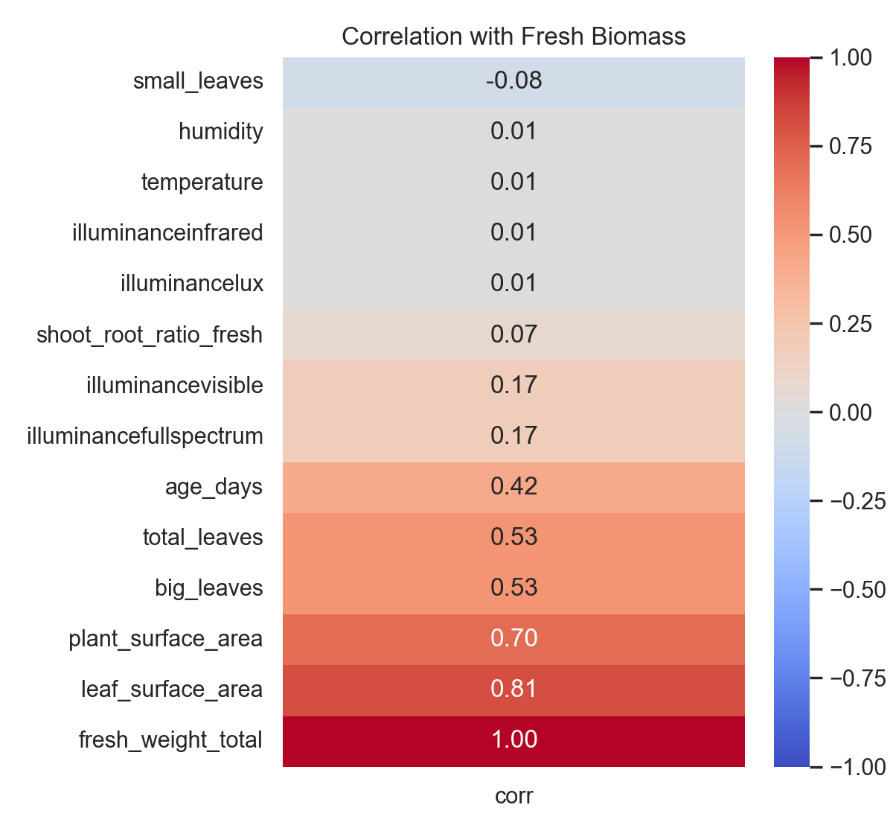
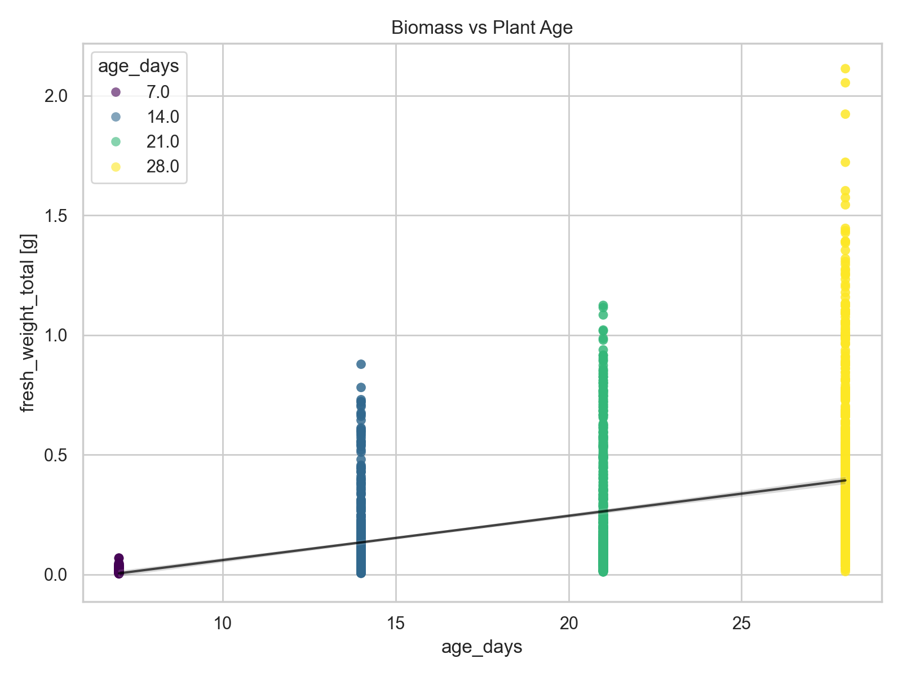
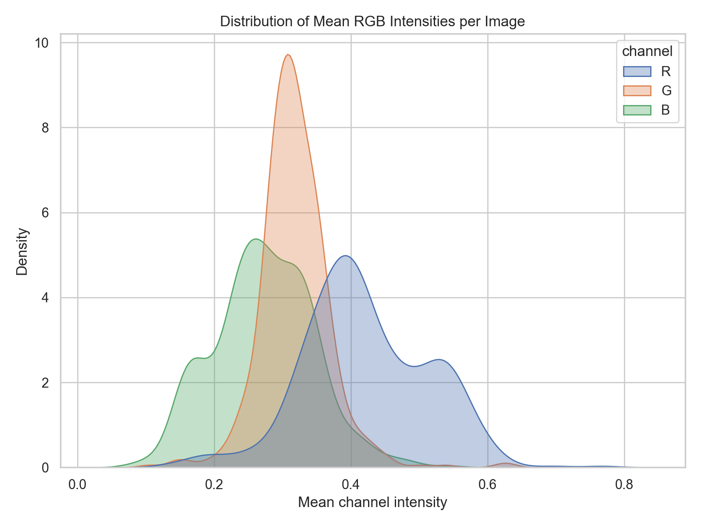
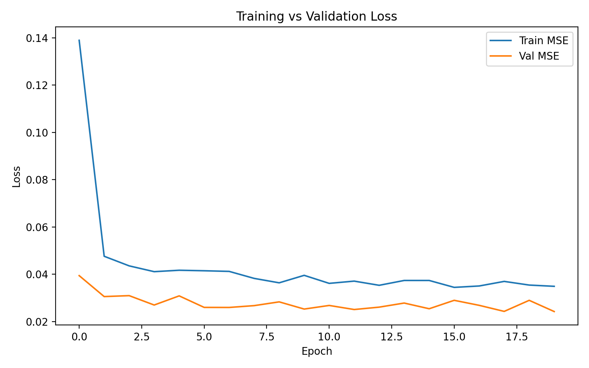

# MLOps Lab Block 1 - Manual End-to-End ML Model Training

This repository implements the full workflow requested in MLOps Lab Block 1 for predicting plant biomass from FarmBot imagery. It now contains exploratory analysis, a reproducible PyTorch training pipeline, experiment logging, and documentation of findings plus challenges.

## Repository Structure

- `figures/`: Plots produced during EDA (`target_distribution.png`, `sample_images.png`, `correlation_heatmap.png`, `age_vs_biomass.png`, `image_pixel_analysis.png`).
- `results/`: Numerical summaries (`eda_summary.json`, `metrics.txt`) plus `training_curves.png`.
- `models/`: Saved checkpoints from `train_model.py` (ignored by git to avoid shipping weights).
- `train_model.py`: Main training script with CLI/argparse, logging, and the ResNet regression model.
- `eda.py`: Utility script that generates the required plots and dumps dataset stats.
- `requirements.txt`: Shared dependencies.
- `training.log`: Output from the latest run of `train_model.py`.

## Dataset Overview

The Excel metadata file contains 4,294 image rows (one PNG per plant snapshot). After filtering to rows with biomass labels, 3,684 samples remain for supervised learning (85.8 percent of the data). Key stats (see `results/eda_summary.json`):

| Metric | Value |
| --- | --- |
| Number of labeled samples | 3,684 |
| Fresh biomass mean +/- std | 0.26 g +/- 0.29 g |
| Target range | 0.002 g to 2.11 g |
| Validation split | 20 percent using plant-aware grouping (GroupShuffleSplit) |
| Images per plant | Up to 42 snapshots per `plant_number` |

Only the RGB imagery plus `fresh_weight_total` are used as model inputs/targets; metadata stays untouched apart from grouping and reporting.

## Exploratory Data Analysis

The script `python eda.py` regenerates all plots below and saves them under `figures/`.

### 1. Target Distribution



Biomass is right-skewed with most plants below 0.5 g. The long tail up to 2.11 g motivates using a regression-friendly loss (MSE) and possibly log-scaling for more advanced models.

### 2. Sample Labeled Images


Sampled views highlight heterogeneous backgrounds (soil moisture, trays), lighting changes, and varying zoom levels. These variations guide the augmentation choices (horizontal flips, color jitter).

### 3. Metadata Correlations



Leaf and plant surface area correlate most with biomass, but these measurements contain many missing values. Environmental readings (temperature, humidity, illuminance) show weak correlation, so the model should focus on visual cues.

### 4. Biomass vs. Plant Age



Older plants generally weigh more, but the scatter also reveals repeated measurements per plant, which is why the final split groups by `plant_number`.

### 5. Pixel Intensity Analysis



The mean channel distributions show dominant green intensities and wide lighting variation. Normalizing with ImageNet statistics plus basic color jitter stabilizes CPU-only training.

## Data Quality Issues

Identified from `eda_summary.json` and manual inspection:

1. **Missing labels:** 14.2 percent of rows lack `fresh_weight_total`, so a notable subset of imagery cannot be used for supervised learning without semi-supervised approaches.
2. **Sparse metadata:** `age_days` is missing in 11.5 percent of the entries, limiting longitudinal analysis.
3. **Leakage risk:** 168 plant identifiers have multiple snapshots (up to 42). Random row-based splits would leak the same plant into training and validation sets, so `GroupShuffleSplit` groups by `plant_number`.

## Modeling Approach

- **Data pipeline:** `BiomassDataset` lazily loads PNGs, applies torchvision transforms (224x224 resize, flips, rotation, color jitter on the train set; deterministic resize on validation), and returns tensors with scalar targets (`train_model.py:72-155`).
- **Split strategy:** `GroupShuffleSplit` keeps images from the same `plant_number` together, while `filter_missing_images` logs and drops missing files (`train_model.py:93-155`).
- **Architecture:** Pretrained `ResNet18` (ImageNet weights) serves as the backbone. All backbone layers are frozen by default while a custom regression head (Dropout -> Linear(256) -> ReLU -> Linear(1)) learns plant-specific cues (`train_model.py:158-185`).
- **Training loop:** AdamW optimizes only unfrozen parameters, MSE loss drives learning, and RMSE is reported for interpretation (`train_model.py:187-233`).
- **Logging and CLI:** Argparse exposes the required flags, while logging writes to both console and `training.log`, including the git commit hash and artifact paths (`train_model.py:253-365`).

## Training Run and Results

Command executed on CPU:

```
python train_model.py --epochs 2 --batch_size 16 --learning_rate 5e-4 --model_out models/resnet18_biomass.pt --freeze_backbone
```

Artifacts:

- `training.log`: detailed run trace (epochs, metrics, artifact paths).
- `results/metrics.txt`: JSON summary of the best epoch (val MSE/RMSE at epoch 1).
- `results/training_curves.png`: loss curves (train vs validation).
- `models/resnet18_biomass.pt`: best checkpoint (kept out of git via `.gitignore`).

Validation performance:

| Metric | Value (best epoch = 1) |
| --- | --- |
| MSE | 0.0342 |
| RMSE | 0.1850 g |



Training for two epochs already converges reasonably thanks to the frozen backbone. The second epoch slightly overfits on CPU, which is visible in the validation curve.

## Challenges

- **Compute constraints:** Training ResNet18 on roughly 3k images using CPU takes about three minutes. Increasing epochs or unfreezing the backbone would quickly become impractical without GPU access.
- **Label imbalance:** Many low-biomass samples dominate the histogram, making it hard for MSE to emphasize heavier plants.
- **Incomplete metadata:** Important fields (leaf counts, plant age, surface area) contain enough NaNs that incorporating them would require more elaborate imputation.

## Potential Improvements

1. Fine-tune deeper layers (or switch to EfficientNet) once GPU access is available.
2. Add grouped K-fold validation to estimate variance across experimental setups.
3. Experiment with log-transforming the target or using Huber loss to reduce sensitivity to heavy-tail outliers.
4. Integrate metadata via a two-headed network after implementing robust imputation and normalization.

## Reproduction Guide

1. **Install dependencies**
   ```
   pip install -r requirements.txt
   ```
2. **Generate EDA plots and stats**
   ```
   python eda.py
   ```
3. **Train the model**
   ```
   python train_model.py --epochs 2 --batch_size 16 --learning_rate 5e-4
   ```
   Adjust flags such as `--model_name resnet34` or `--unfreeze_backbone` as needed.
4. **Export documentation to PDF** (per lab instructions)
   ```
   pandoc README.md -o README.pdf
   # or use a Markdown-to-PDF extension in VS Code
   ```

All outputs land in `figures/`, `results/`, `training.log`, and (optionally) `models/`. Delete or rename the checkpoint before committing if needed, since the directory is ignored by git.

